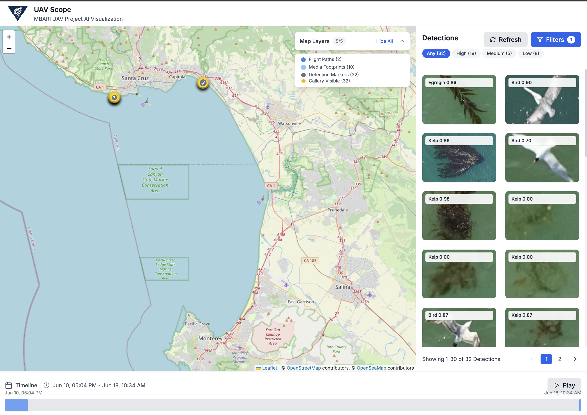

# UAVScope

[](https://www.typescriptlang.org/)
[](https://github.com/semantic-release/semantic-release)

A React-based application for visualizing UAV mission data with interactive maps, detection galleries, and timeline filtering.

Author: dcline at mbari.org

[](uavscope.png)

## Features

- **Interactive Map**: Leaflet-based map with nautical and satellite basemaps
- **Detections**: Grid and list views
- **Timeline**: Animated timeline with mission visualization
- **Advanced Filtering**: Date range, category, confidence, and verification filters
- **Real-time Interaction**: Bidirectional highlighting and filtering between map extents and gallery

## Tech Stack

- React 18 + TypeScript
- Vite for fast development
- Leaflet with preferCanvas for performance
- Tailwind CSS for styling
- Zustand for state management
- React Query for data fetching

## Getting Started

1. Install dependencies:
```bash
npm install
```

2. Start development server:
```bash
npm run dev
```

3. Open [http://localhost:3000](http://localhost:3000) in your browser

## Project Structure

```
src/
├── components/
│   ├── Map/           # Map visualization components
│   ├── Gallery/       # Detections gallery components
│   ├── Timeline/      # Timeline components
│   ├── Filters/       # Filter components
│   └── Layout/        # Layout components
├── services/          # Data services and API calls
├── stores/            # Zustand state stores
├── types/             # TypeScript type definitions
```

## Data Models

The application works with three main data types:

- **Detections**: Detections from our algorithms with attributes, coordinates, and metadata such as saliency, area, or clusters
- **Media**: Image files with geolocation and file information
- **Mission**: Flight missions with start/end times and identifiers

## Development

- `npm run dev` - Start development server
- `npm run build` - Build for production
- `npm run preview` - Preview production build
- `npm run lint` - Run ESLint

